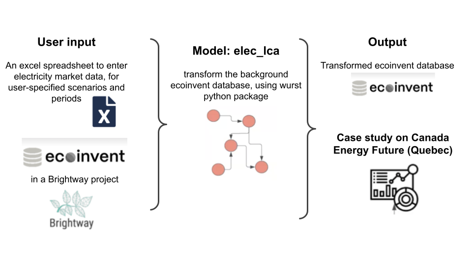

# About the model 

## Problems: 

The current ecoinvent database builds up a grid electricity mix, with static and outdated market data 

## Solutions: 
Update the ecoinvent electricity market for user-selected location(s), scenario(s), and period(s), and relinking the new electricity to the whole database. 

